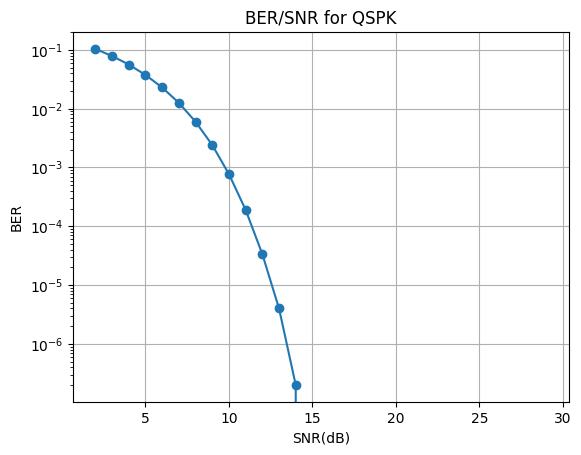
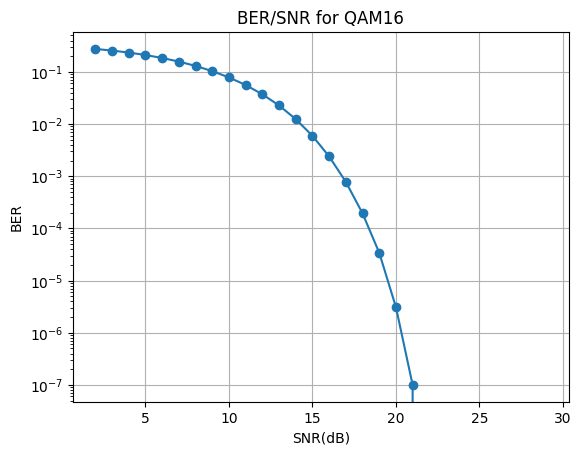
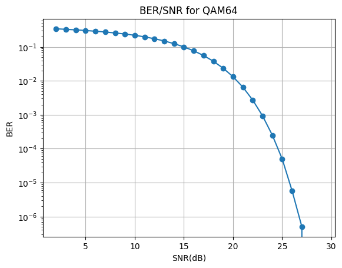

# QSPK, QAM16, QAM64 модулятор/демодулятор с добавлением AWGN
Проект представляет собой реализацию модулятора и демодулятора для QSPK, QAM16, QAM64 с добавлением Гауссовского белого шума.
# Использование
1. Скопируйте репозиторий
2. Скомпилируйте проект и запустите.
3. Будут созданы 3 файла: "QSPK.txt", "QAM16.txt", "QAM64.txt"
4. Эти файлы используются для построения графиков программой graphics.ipynb
##Пример
Была сгенерированна последовательность из случайных 10e7 бит. 
Ниже представленны графики зависимости BER от SNR(дБ). 

#Результаты

BER = 0 начиная с SNR = 15 дБ при QSPK модуляции, начиная с 22 дБ при QAM16 модуляции и начиная с 28 дБ при QAM64 модуляции.
